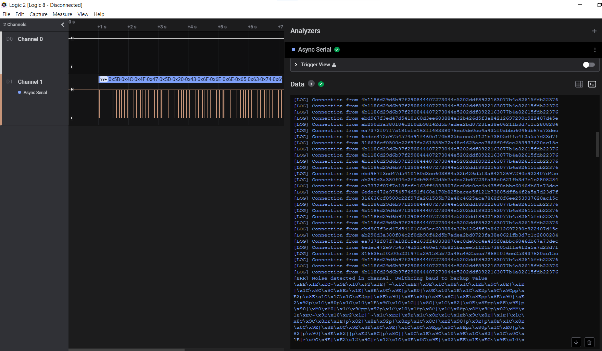

# Serial Logs

## Problem

We have gained physical access to the debugging interface of the Access Control System which is based on a Raspberry Pi-based IoT device. We believe that the log messages of this device contain valuable information of when our asset was abducted.

[Task file](files/serial_logs.sal)

## Solution

### Analyze of file

First of all, we should understand what kind of file we have.
Google of __.sal__ extension we find ```SAL is an acronym for SQL Application Language.```
Strange what SQL Application does in IoT device and how it is connected with "log messages" and "physical access to the debugging interface". 
Command ```file``` will help us.


After that decompress it and analyze:


Interesting string in ```digital-*``` files:
<SALEAE>
Google it, we found https://www.saleae.com/ with tool Logic 2.
Download and install it.

### Solving task

Open file serial_logs.sal in Logic 2 tool.
What do we see?


Based on the next facts:
* physical access to the debugging interface .. on a Raspberry Pi-based IoT device
* name of the task "Serial logs"
Select "Async serial" analyzer.


We should select Channel 1 in “Input Channel” because as we can see we have signals only on the first channel.
In “Bit Rate” we should add the speed of the connection.
Who works with Raspberry Pi through the serial port, knows, speed is 115200. Insert it in “Bit Rate” and click “Save”.
Switch the “Data” field to “Terminal” for showing as raw data as it was transferred, not in a table view.



As we can see it is a log of connections to the Access Control System which is based on a Raspberry Pi-based IoT device.
But in one place it changes and the last readable message is ```Switching baud to backup value```
It means we should gues baud or bitrate for reading the last part of the logs.
Someone can understand how to change bitrate based on a signal:


But not me, I just brute-force it, based on possible values for serial port, which found on wiki ;)
(Serial port)[https://en.wikipedia.org/wiki/Serial_port ]
Change value of "Bit Rate" to 76,800 and check "Data" field again.
Scroll down and see:


Flag: ```CHTB{wh47?!_f23qu3ncy_h0pp1n9_1n_4_532141_p2070c01?!!!52}```

## TL;DR

  - use Logic 2 from https://www.saleae.com/ 
  - Brute-force bit rate