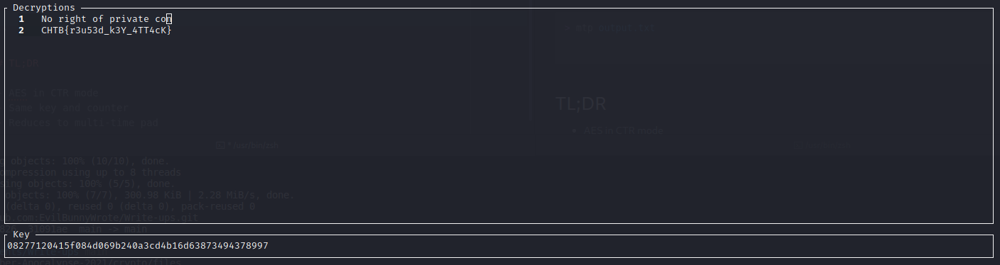

# PhaseStream 3

## Problem

The aliens have learned the stupidity of their misunderstanding of Kerckhoffs's principle. Now they're going to use a well-known stream cipher (AES in CTR mode) with a strong key. And they'll happily give us poor humans the source because they're so confident it's secure!

[Task file](files/crypto_ps3.zip)

## Solution

We are given 2 ciphertexts and source code of script used to produce them. It is AES in CTR mode, which isn't vulnerable by itself, but looking closer we can see that it reuses same key and resets counter with every encryption, which reduces it to a multi-time pad problem. Moreover, plaintext for the first ciphertext is hardcoded in the source, so it is easily solved by [mtp](https://github.com/CameronLonsdale/MTP):

```sh
> mtp output.txt
```


## TL;DR

 - AES in CTR mode
 - Same key and counter
 - Reduced to multi-time pad
