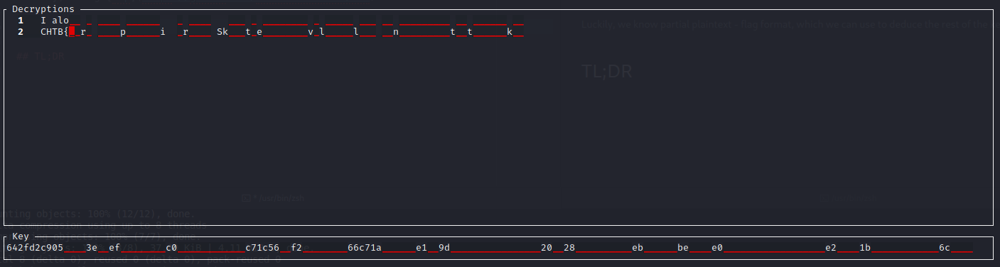
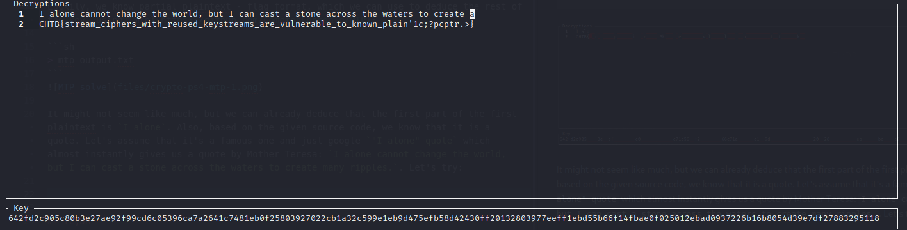
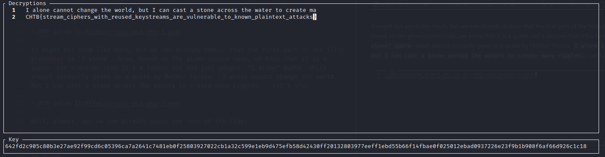

# PhaseStream 4

## Problem

The aliens saw us break PhaseStream 3 and have proposed a quick fix to protect their new cipher.

[Task file](files/crypto_ps4.zip)

## Solution

We are given 2 ciphertexts and source code of script used to produce them. It is AES in CTR mode, which isn't vulnerable by itself, but looking closer we can see that it reuses same key and resets counter with every encryption, which reduces it to a multi-time pad problem.

Luckily, we know partial plaintext - flag format, which we can use to deduce the rest of the key, using [mtp](https://github.com/CameronLonsdale/MTP):

```sh
> mtp output.txt
```


It might not seem like much, but we can already deduce that the first part of the first plaintext is `I alone`. Also, based on the given source code, we know that it is a quote. Let's assume that it's a famous one and just google `"I alone" quote` which almost instantly gives us a quote by Mother Teresa: `I alone cannot change the world, but I can cast a stone across the waters to create many ripples.`. Let's try:



Well, almost, but we can already guess the rest of the flag:



## TL;DR

- AES in CTR mode
- Same key and counter
- Reduced to multi-time pad
