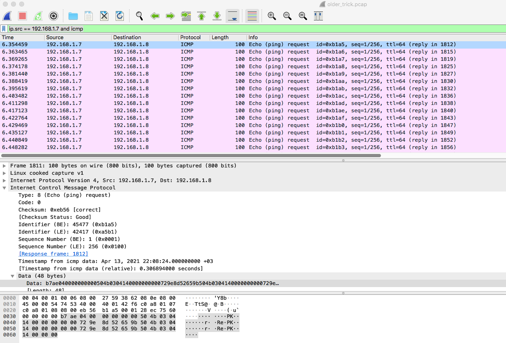

[task file](files/forensics_oldest_trick.zip)

used tools:
- wireshark
- tshark
- [firefox_decrypt](https://github.com/unode/firefox_decrypt)

Look into packets for something interesting: first what we found is mixed case DNS answers and try DNS 0x20 decode to get something, but no fortune

All tcp sessions are TLS encrypted and no extra information found

Also we have a bunch od ICMP packets, let look into them.
we can see that all ICMP packets have data into them, request and reply have the same data 

Let filter out needed packets
```ip.src == 192.168.1.7 and icmp```

packet data:

We see text that looks like a zip archive header and data is multiple times duplicated
Let check zip signature '\x50\x4b\x03\x04' and it is fits perfectly.
let see other packets and  find out that the data have the same format and offsets so lets extract that data
We will use tshark to get data from packets and then get data from specified offsets

to extract data use following command
```tshark -r older_trick.pcap -Y "ip.src == 192.168.1.7 and icmp" -T fields -e data```

output should be like that
```output
b7ae040000000000504b0304140000000000729e8d52659b504b0304140000000000729e8d52659b504b030414000000
ead10400000000004c6b18000000180000001000000066694c6b18000000180000001000000066694c6b180000001800
99e80400000000006e692f6164646f6e732e6a736f6e7b226e692f6164646f6e732e6a736f6e7b226e692f6164646f6e
cafb040000000000736368656d61223a362c226164646f6e736368656d61223a362c226164646f6e736368656d61223a
281805000000000073223a5b5d7d504b030414000000080073223a5b5d7d504b030414000000080073223a5b5d7d504b
```
next we have to identify offset and data length to filter it out it could be done with ```cut -c``` 
but we will use perl to get data convert it from hex to binary format

Offset is 48 and length is 32

Full command to extract data is:
```command
tshark -r older_trick.pcap -Y "ip.src == 192.168.1.7 and icmp" -T fields -e data | perl -nle 'BEGIN{$s=""};$s.=pack("H*",substr($_,48,32));END{print $s}' > file.zip
```

So we got zip file ```file.zip``` and extract it to explore what we have inside

```file content
unzip file.zip
Archive:  file.zip
 extracting: fini/addons.json
  inflating: fini/addonStartup.json.lz4
  inflating: fini/broadcast-listeners.json
  inflating: fini/cert9.db
  inflating: fini/compatibility.ini
  inflating: fini/containers.json
  inflating: fini/content-prefs.sqlite
  inflating: fini/cookies.sqlite
  inflating: fini/cookies.sqlite-shm
  inflating: fini/cookies.sqlite-wal
  inflating: fini/extension-preferences.json
  inflating: fini/extensions.json
  inflating: fini/favicons.sqlite
  inflating: fini/favicons.sqlite-shm
  inflating: fini/favicons.sqlite-wal
  inflating: fini/formhistory.sqlite
  inflating: fini/handlers.json
  inflating: fini/key4.db
  inflating: fini/logins.json
  inflating: fini/permissions.sqlite
  inflating: fini/pkcs11.txt
  inflating: fini/places.sqlite
  inflating: fini/places.sqlite-shm
  inflating: fini/places.sqlite-wal
  inflating: fini/prefs.js
  inflating: fini/protections.sqlite
  inflating: fini/search.json.mozlz4
  inflating: fini/sessionCheckpoints.json
 extracting: fini/shield-preference-experiments.json
  inflating: fini/SiteSecurityServiceState.txt
  inflating: fini/storage.sqlite
  inflating: fini/times.json
  inflating: fini/webappsstore.sqlite
  inflating: fini/webappsstore.sqlite-shm
  inflating: fini/webappsstore.sqlite-wal
  inflating: fini/xulstore.json
```
Content of archive looks like mozilla firefox profile, so we checked files for plaintext flag but no luck

We have key4.db file and try to extract information using firefox_decrypt tool

```extract data from key4.db
python3 ./firefox_decrypt.py <path_to_profile_directory>
2021-04-21 01:44:54,018 - WARNING - profile.ini not found in <path_to_profile_directory>
2021-04-21 01:44:54,018 - WARNING - Continuing and assuming '<path_to_profile_directory>' is a profile location

Website:   https://rabbitmq.makelarid.es
Username: 'Frank_B'
Password: 'CHTB{long_time_no_s33_icmp}'
```

We got the flag CHTB{long_time_no_s33_icmp}
