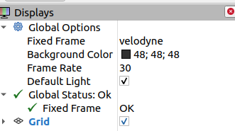

# Robotic Infiltration

## Problem

We were able to hack a robot that was operating at a target facility and log its readings using ROS. The robot has an advanced lidar scanner, and these readings should allow us to rebuild the plan for the facility, and will be essential for the next steps of our mission.

[Task file](files/misc_robotic_inflitration.zip)

## Solution

We are given a `.bag` file with lidar readings, which is a special format of ROS, which a framework for writing robot software. I'm no expert in the field, but basically this `.bag` file is a set of events, which ROS can interpret and visualize.

First of all we have to install framework itself, it's pretty straightforward and instructions can be found on their website: http://ros.org/. Our `.bag` file is an old (ROS v1) format and I recommend installing latest ROS v1. ROS v2 seems to have backwards compatibility plugin, but I couldn't get it to work.

We need 2 packages: `rosbag` to replay recorded events and `rviz` to get visualization.

Let's get to it:

```sh
# Prepare our environment
> source /opt/ros/noetic/setup.bash

# Start ROS master node
> roscore &

# Start visualization utility
> rviz &

# Start the playback
> rosbag play capture.bag
```

Right after playback is started, we should pause it (press spacebar) and configure our view a bit:

 1. Change fixed frame to `velodyne` so we start tracking a sensor that we need:

 

 2. Add actual sensor readings to the view:

 

 3. (optional) Tweak points display options to make it a bit easier to read:

 

 We resume our playback and at some point we start seeing the flag:

 

I'm sure there's easier way to display and read the flag, but it should do it for the CTF.

## TL;DR

 - Given ROS lidar recording
 - Install ROS and play it back
