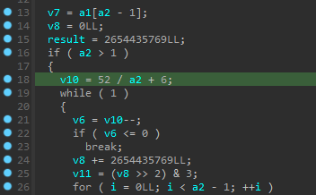
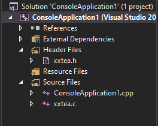
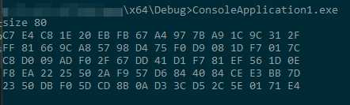
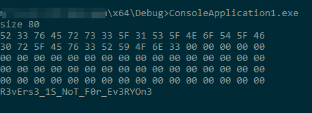

# cup-of-tea

Details:

```
For my friend a cup of Tea and a wonderful message: D0A4AE4DCC99E368BABD66996D67B88159ABE2D022B0AD78F1D69A6EB1E81CF3589B3EFE994005D6A9DE9DB2FD3C44B77628D2316AAC2229E938EC932BE42220DD6D1D914655820A43C09E2236993A8D

Flag: CTF{sha256(decrypt_message)}
```

Given a binary [cup-of-tea](./cup-of-tea.zip)

Let's open in in IDA PRO and analyze.

The `main` function looks pretty straightforward:
```c
int __cdecl main(int argc, const char **argv, const char **envp)
{
  int i; // [rsp+0h] [rbp-20A0h]
  int v6; // [rsp+4h] [rbp-209Ch]
  __int64 key[16]; // [rsp+10h] [rbp-2090h] BYREF
  char s[80]; // [rsp+90h] [rbp-2010h] BYREF
  char v9[4104]; // [rsp+1090h] [rbp-1010h] BYREF
  unsigned __int64 v10; // [rsp+2098h] [rbp-8h]

  v10 = __readfsqword(0x28u);
  key[0] = 'I';
  key[1] = ' ';
  key[2] = 'l';
  key[3] = 'o';
  key[4] = 'v';
  key[5] = 'e';
  key[6] = ' ';
  key[7] = 'p';
  key[8] = 'a';
  key[9] = 'n';
  key[10] = 'c';
  key[11] = 'a';
  key[12] = 'k';
  key[13] = 'e';
  key[14] = 's';
  strcpy(s, "Betaflash_is_slow");
  *(_WORD *)&s[18] = 0;
  *(_DWORD *)&s[20] = 0;
  *(_QWORD *)&s[24] = 0LL;
  memset(&s[32], 0, 0xFE0uLL);
  puts("We are under attack.");
  puts("We need a group of hacker to decrypt this weird message.");
  puts("And Betaflash is not slow :)).");
  encrypt(s, 10LL, key);
  v6 = strlen(s);
  for ( i = 0; i < v6; ++i )
    sprintf(&v9[2 * i], "%02X", (unsigned __int8)s[i]);
  v9[2 * i] = 0;
  printf("Decrypt me if you can: %s\n", v9);
  return __readfsqword(0x28u) ^ v10;
}
```

I renamed the key variables to be more readable, so we can see the application
does encryption of a string `"Betaflash_is_slow"` using the key `"I love pancakes"` and then it prints hex dump of the ciphertext to console.


Let's analyze the `encrypt` function.
```c
__int64 __fastcall encrypt(_QWORD *a1, __int64 a2, __int64 a3)
{
  __int64 result; // rax
  unsigned __int64 *v4; // rax
  __int64 v5; // rcx
  __int64 v6; // rax
  unsigned __int64 v7; // [rsp+20h] [rbp-38h]
  unsigned __int64 v8; // [rsp+28h] [rbp-30h]
  __int64 i; // [rsp+30h] [rbp-28h]
  __int64 v10; // [rsp+38h] [rbp-20h]
  __int64 v11; // [rsp+50h] [rbp-8h]

  v7 = a1[a2 - 1];
  v8 = 0LL;
  result = 2654435769LL;
  if ( a2 > 1 )
  {
    v10 = 52 / a2 + 6;
    while ( 1 )
    {
      v6 = v10--;
      if ( v6 <= 0 )
        break;
      v8 += 2654435769LL;
      v11 = (v8 >> 2) & 3;
      for ( i = 0LL; i < a2 - 1; ++i )
      {
        v4 = &a1[i];
        *v4 += (((4LL * a1[i + 1]) ^ (v7 >> 5)) + ((a1[i + 1] >> 3) ^ (16 * v7))) ^ ((a1[i + 1] ^ v8)
                                                                                   + (v7 ^ *(_QWORD *)(8 * (v11 ^ i & 3) + a3)));
        v7 = *v4;
      }
      v5 = 8 * a2 - 8;
      *(_QWORD *)((char *)a1 + v5) += (((4LL * *a1) ^ (v7 >> 5)) + ((*a1 >> 3) ^ (16 * v7))) ^ ((*a1 ^ v8)
                                                                                              + (v7 ^ *(_QWORD *)(8 * (v11 ^ i & 3) + a3)));
      v7 = *(_QWORD *)((char *)a1 + v5);
    }
    return 0LL;
  }
  return result;
}
```

I'm usually start analyzing the crypto algorithms with checking numeric constants like the following `result = 2654435769LL`. Quick grep using Google says brings me to the [Tiny Encryption Algorithm or TEA WiKi](https://en.wikipedia.org/wiki/Tiny_Encryption_Algorithm). This corresponds the task name `cup-of-tea` so we in the right direction.

The algorithm in wiki has our constant `2654435769 or 0x9E3779B9` but the code example doesn't correspond our decompiled code at first glance.

Let's check the TEA algorithm successors:

| Algorithm | Standard Feistel network rounds number | Block size  | Key size        |
|-----------|----------------------------------------|-------------|-----------------|
| TEA       | 64                                     | 64 bits     | 128 bits        |
| XTEA      | 64                                     | 64 bits     | 128 bits        |
| XTEA-1    | 32                                     | 64 bits     | 128 bits        |
| XTEA-2    | 64                                     | 128 bits    | 128 bits        |
| XTEA-3    | 64                                     | 128 bits    | 256 bits        |
| XXTEA     | 52 + 12 * M                            | 64 * M bits | 128 bits        |
| RTEA      | 48 or 64                               | 64 bits     | 128 or 256 bits |
| Raiden    | 32                                     | 64 bits     | 128 bits        |

We can spot the similarity of XXTEA algorithm Feistel rounds number `52 + 12 * M` from the table above matches with
the code we have:



Let's grab some existing XXTEA Python library and check its output having same input data and key.

I found two libraries:
- [xxtea-py](https://github.com/xxtea/xxtea-python)
- xxtea

Let's start from first one. The first goal is to make sure encoding works as expected, so let's
grab the `./cup-of-tea` encoded hex values. Having input data and key same the encoded result has to be equal
to what we grabbed.

Here is the first trial, what we have pay attention to
 
```python
key = b'I love pancakes\0'
plain_test = b'Betaflash_is_slow'.rjust(80, b'\0')
expect = bytes.fromhex('C7E4C81E20EBFB67A4977BA91C9C312FFF81669CA85798D475F0D9081DF7017CC8D009ADF02F67DD41D1F781EF561D0EF8EA2225502AF957D6844084CEE3BB7D2350DBF05DCD8B0AD33CD52C5E0171E4')
enc = encrypt(plain_test, key)
print(enc == expect)
print(enc[:16].hex().upper())
```

But the output is negative:
```
0AED8E4B82D7FBCF2D99AFB0762988C1
False
```

Lets compare original XXTEA with what we have in the binary. I opened the `xxtea-py` 
package source and I see that the core of this library is written in C, the `xxtea.c` is what we 
wanted to check. 
```c
static uint32_t * xxtea_uint_encrypt(uint32_t * data, size_t len, uint32_t * key) {
    uint32_t n = (uint32_t)len - 1;
    uint32_t z = data[n], y, p, q = 6 + 52 / (n + 1), sum = 0, e;

    if (n < 1) return data;

    while (0 < q--) {
        sum += DELTA;
        e = sum >> 2 & 3;

        for (p = 0; p < n; p++) {
            y = data[p + 1];
            z = data[p] += MX;
        }

        y = data[0];
        z = data[n] += MX;
    }

    return data;
}
```

It looks very close to our algorithm except few differences:
* `key` in the code is defined as `uint32_t *` a pointer to 4-byte long values array, 
but in the binary we see that key is passed as an array of `__int64` values. Also we know
That the algorithm key length is 16-bytes long by definition.
* `data` pointer in binary points to the `_QWORD` which is `uint64_t`, but in the algorithm
it has type `uint32_t * `

Having all this in mind, lets make simple C++ application to do encryption/decryption. 
I used Visual Studio 2017 to create a simple Console Application in C++, copied `xxtea.{c,h}` to it
and added to the project:


**I selected 64-bit target in Visual Studio**

As we have `xxtea_uint_decrypt` and `xxtea_uint_encrypt` used 32-bit pointers, I create my 
own copies of them with the suffix `64` and 64-bit pointers:

In the xxtea.h:
```cpp
uint64_t * xxtea_uint_encrypt64(uint64_t * data, size_t len, uint64_t * key);
uint64_t * xxtea_uint_decrypt64(uint64_t * data, size_t len, uint64_t * key);
```

In the xxtea.c:
```cpp
uint64_t * xxtea_uint_encrypt64(uint64_t * data, size_t len, uint64_t * key) {
	uint64_t n = (uint64_t)len - 1;
	uint64_t z = data[n], y, p, q = 6 + 52 / (n + 1), sum = 0, e, first, second;

	if (n < 1) return data;

	while (0 < q--) {
		sum += DELTA;
		e = sum >> 2 & 3;

		for (p = 0; p < n; p++) {
			y = data[p + 1];
			first = (((z >> 5) ^ (y << 2)) + ((y >> 3) ^ (z << 4)));
			second = ((sum ^ y) + (key[(p & 3) ^ e] ^ z));
			z = data[p] += first ^ second;
		}

		y = data[0];
		z = data[n] += MX;
	}

	return data;
}

uint64_t * xxtea_uint_decrypt64(uint64_t * data, size_t len, uint64_t * key) {
	uint64_t n = (uint64_t)len - 1;
	uint64_t z, y = data[0], p, q = 6 + 52 / (n + 1), sum = q * DELTA, e;

	if (n < 1) return data;

	while (sum != 0) {
		e = sum >> 2 & 3;

		for (p = n; p > 0; p--) {
			z = data[p - 1];
			y = data[p] -= MX;
		}

		z = data[n];
		y = data[0] -= MX;
		sum -= DELTA;
	}

	return data;
}
```

Then running the following code I got match of expected encrypted output with what we received
from the binary:
```cpp
#include <iostream>
#include <iomanip>
#include <stdio.h>
#include "xxtea.h";

int main()
{
	static const char plainText[80] = "Betaflash_is_slow";
	static const char key[] = "I\0\0\0\0\0\0\0 \0\0\0\0\0\0\0l\0\0\0\0\0\0\0o\0\0\0\0\0\0\0";
	char buff[1024] = {};
	memcpy(buff, plainText, strlen(plainText));
	size_t out_len = 80;
	const char* encrypted = (const char*)xxtea_uint_encrypt64((uint64_t*)buff, 80 / sizeof(uint64_t), (uint64_t*)key);
	
	printf("size %zu\n", out_len);
	for (size_t i = 0; i < out_len; ++i) {
		printf("%02X ", (unsigned int)encrypted[i] & 0xFF);
		if ((i + 1) % 16 == 0) {
			printf("\n");
		}
	}
    printf("\n");
}
```



Ok then now we can put our cipher text to the decryption function:
```cpp
int main()
{
	static const char cipherText[80] = { 0xd0, 0xa4, 0xae, 0x4d, 0xcc, 0x99, 0xe3, 0x68, 0xba, 0xbd, 0x66, 0x99, 0x6d, 0x67, 0xb8, 0x81, 0x59, 0xab, 0xe2, 0xd0, 0x22, 0xb0, 0xad, 0x78, 0xf1, 0xd6, 0x9a, 0x6e, 0xb1, 0xe8, 0x1c, 0xf3, 0x58, 0x9b, 0x3e, 0xfe, 0x99, 0x40, 0x05, 0xd6, 0xa9, 0xde, 0x9d, 0xb2, 0xfd, 0x3c, 0x44, 0xb7, 0x76, 0x28, 0xd2, 0x31, 0x6a, 0xac, 0x22, 0x29, 0xe9, 0x38, 0xec, 0x93, 0x2b, 0xe4, 0x22, 0x20, 0xdd, 0x6d, 0x1d, 0x91, 0x46, 0x55, 0x82, 0x0a, 0x43, 0xc0, 0x9e, 0x22, 0x36, 0x99, 0x3a, 0x8d };
	static const char key[] = "I\0\0\0\0\0\0\0 \0\0\0\0\0\0\0l\0\0\0\0\0\0\0o\0\0\0\0\0\0\0";
	char buff[1024] = {};
	memcpy(buff, cipherText, strlen(cipherText));
	size_t out_len = 80;
	
	const char* decrypted = (const char*)xxtea_uint_decrypt64((uint64_t*)buff, 80 / sizeof(uint64_t), (uint64_t*)key);
	printf("size %zu\n", out_len);
	for (size_t i = 0; i < out_len; ++i) {
		printf("%02X ", (unsigned int)decrypted[i] & 0xFF);
		if ((i + 1) % 16 == 0) {
			printf("\n");
		}
	}
	printf("%s\n", decrypted);
    printf("\n");
}
```



Ok seems good output, now format the flag and thats it:
```py
>>> from hashlib import sha256
>>> print(f'CTF{{{sha256(b"R3vErs3_1S_NoT_F0r_Ev3RYOn3").hexdigest()}}}')
CTF{b98b74c78593c1238136a2d24d300ad2b1af82b137523adbdde2ba08b02a9cf0}
```

