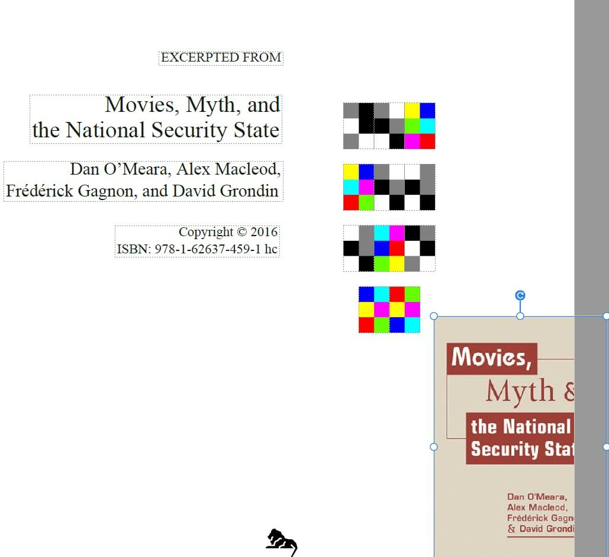

# Spy Agent

## Problem

Think like a spy!

## Solution

We are given a website, in the source of the page `/about.html` we can find hidden base64-encoded string: `aHR0cHM6Ly9tZWdhLm56L2ZpbGUvUTVaR1dMNWEjcW04Y20tV2ZVVVZMbGUyaTA2ZVJITkc0eFRwNjlRY0tJV0JaUmtGSFktVQ==`.

Upon decoding, we get an URL:

```sh
$ echo aHR0cHM6Ly9tZWdhLm56L2ZpbGUvUTVaR1dMNWEjcW04Y20tV2ZVVVZMbGUyaTA2ZVJITkc0eFRwNjlRY0tJV0JaUmtGSFktVQ== | base64 -d
https://mega.nz/file/Q5ZGWL5a#qm8cm-WfUUVLle2i06eRHNG4xTp69QcKIWBZRkFHY-U
```

Uploaded to `mega.nz` is this [file](files/spy-agent.tgz). Running `binwalk` or `foremost` on it, reveals that it has a PDF hidden inside:


There's a code hidden behind an image on this page:



It's a `hexahue cipher`. We can decode it using this tool: `https://www.dcode.fr/hexahue-cipher`, which gives us this string: `14mp455w0rd`.

Going back to the original file, we pass it to `steghide` with a password we've recovered earlier:

```sh
$ steghide extract -sf imitation-game.jpg -p 14mp455w0rd
wrote extracted data to "flag.txt".
```

Flag is inside `flag.txt`.

## TL;DR

  - Ucucuga
  - Classic ciphers
