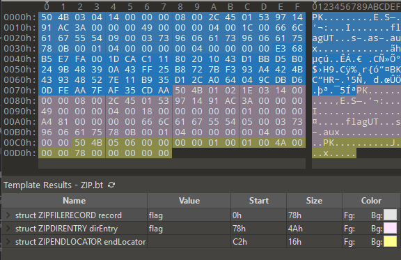

### GOT Happens Tamil CTF task writeup

[task file](files/got_happens.zip)

Open archive and check chall.txt file
```Got Is EveryWhere! and clone the repo "0xcyberpj/got-test"```

Check repository online [github repository](https://github.com/0xcyberpj/got-test) (here is cloned copy
[got-test.tar.gz](files/got-test.tar.gz))

Check what we have in commits history

reverse it but it's a fake flag, so move forward

looks that we got something useful, trying to decode from hex, see base64 data but decoding gives nothing useful, so remembering that fake flag was reversed trying to reverse base64 text.<br>
So now it looks better and contains some visible PKZip header signatures<br>
Cyber chef is useful for playing with various transformations


Now time to play with unpackers and zip recovery tools, but no luck.
Try to check what signatures we have. I used [The structure of a PKZip file](https://users.cs.jmu.edu/buchhofp/forensics/formats/pkzip.html) for that and hex editor.
010 Editor for mac or Synalyze It! for windows are great tools to work with binary files with formats but they costs money, so I use trial version of 010 Editor

Check main file header ```\x50\x4b\x03\x04``` and found that it is located at the bottom of file


 

Ok, let check that block structure, we can apply file template by offset


Let specify offset 0x9F


But template fails and we got error on parsing extrafields


Ok, let try to check it manually and we see that we have 5 bytes missing


let try to find next block which has ```\x50\x4b\x01\x02``` signature


but as we can see we have not full data again broken in the middle of timestamp extra field```id=0x5455``` but we see that out file started with undefined signature but it fits to end of that block


Ok, we identified two blocks, let find last part (End of central directory record) ```\x50\x4b\x05\x06```


Good we found it and template can be automatically applied by offset 0x17h but it is not necessary because last record have structure with only one variable (ZIP file comment) and its length equals 0 in our case 
So, let split or file for already identified parts


Ok, we identified the most parts and as we remember we have first part unfinished with 5 bytes missing of extrafield 0x7875h

Let try to find information about that field, first link in google gives us information 


So, we are missing one byte size and GID which in our case should be 5 bytes and judging by other headers it has value ```\x04 \x00 \x00 \x00 \x00``` and we can find it right after Central directory file block and also we see file data after it

Let see what we have now


two parts missing is out data it should be placed right after local file header
Let create new file from parts 1-2-data1-data2-3-4-5 and apply template to check that all parts are in right offsets


The last thing we have to check is the right order of data blocks save the file and test it with any zip extractor.<br>
We got crc error so now we have to change order of data blocks and extract file.

After extracting archive we got file with content ```54616d696c4354467b315f6c3076335f6731375f776834375f61623075745f7930757d0a```<br> 
It gives us flag ```TamilCTF{1_l0v3_g17_wh47_ab0ut_y0u}```
